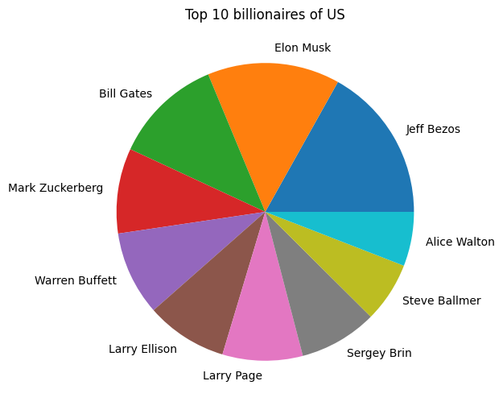

# Plot exercise

## Table of Contents

- [About](#about)
- [Getting Started](#getting_started)
- [Usage](#usage)

## About <a name = "about"></a>

in this part i'm analyze billionaires and Messi's data.

### Output

#### billionaires

Countries with the most billionaires


Industries in which billionaires are active


Top 10 billionaires of US



#### Messi

goal per year


Messi's goals minutes


score in extra time


## Getting Started <a name = "getting_started"></a>

### Installing

First of all you need install requirements library copy this code and run in terminal.

``` terminal
pip install -r requirements.txt
```

## Usage <a name = "usage"></a>

After you install requirements library you can choice between the projects and run it.

### billionaire analyze

``` terminal
jupyter nbconvert --to script billionaire_analyze.ipynb
```

### lionel messi analyze

``` terminal
jupyter nbconvert --to script lionel_messi_analyze.ipynb
```
