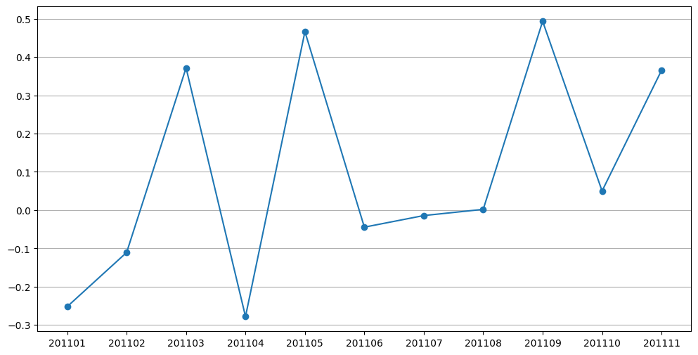
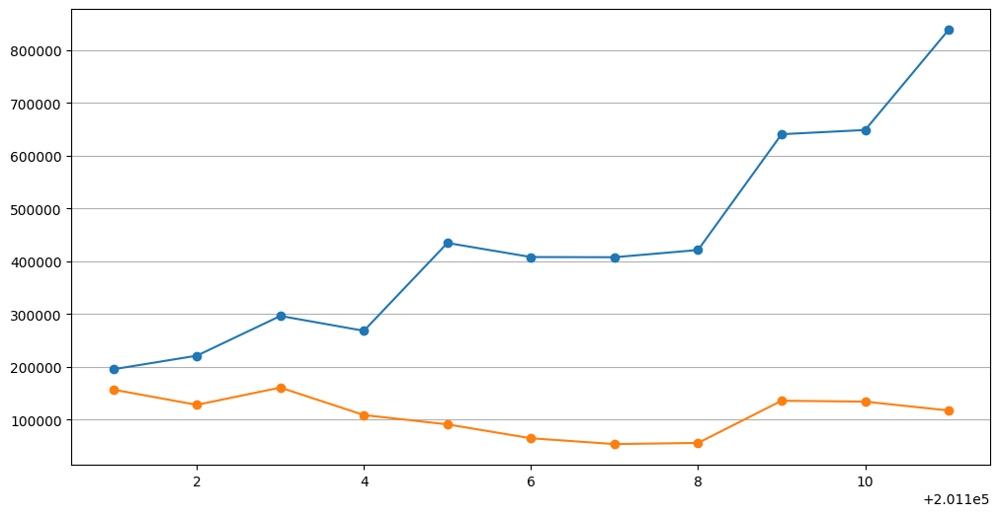
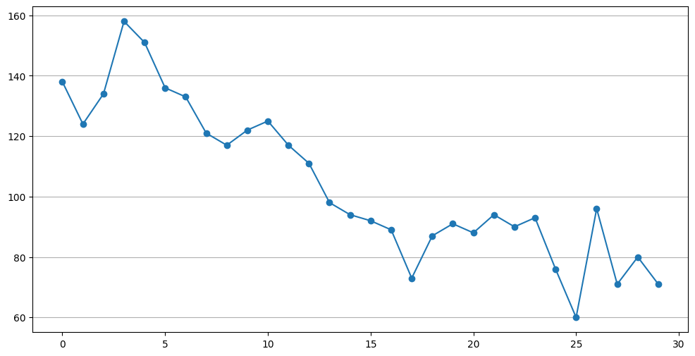
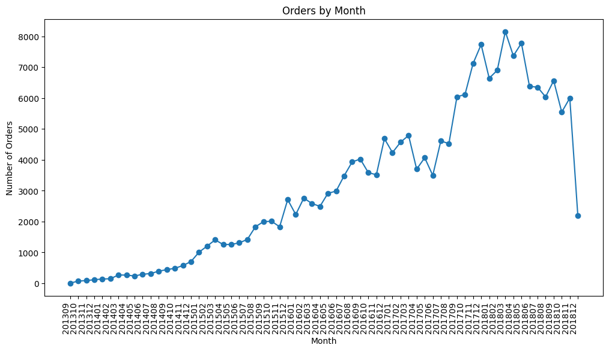
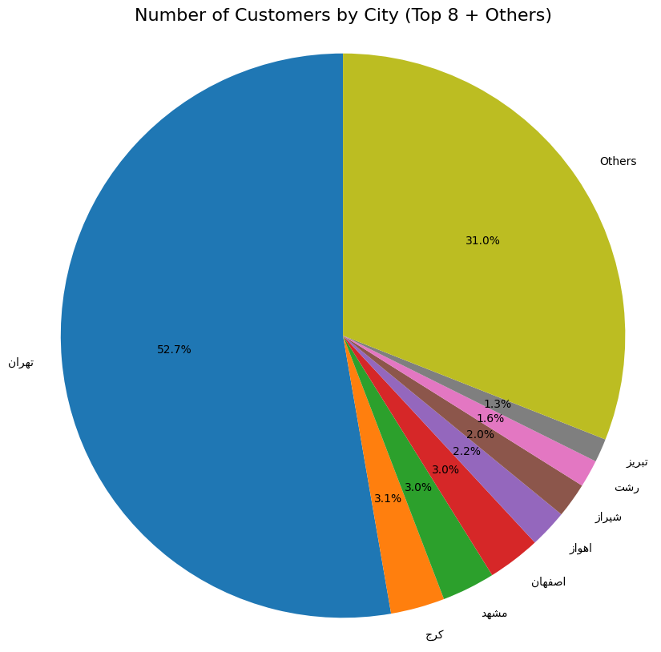

# Plot exercise

## Table of Contents

- [About](#about)
- [Getting Started](#getting_started)
- [Usage](#usage)

## About <a name = "about"></a>

in this part i code some plot like covid death in iran, order by month in digikala and solve problem of online retail.

### Output

#### Online retail

monthly growth


exist member and new member


#### Covid 19

daily death in iran


#### Digikala plot

digikala order by month


digikala customer by city


## Getting Started <a name = "getting_started"></a>

### Installing

First of all you need install requirements library copy this code and run in terminal.

``` terminal
pip install -r requirements.txt
```

## Usage <a name = "usage"></a>

After you install requirements library you can choice between the projects and run it.

### online retail

``` terminal
jupyter nbconvert --to script online_retail_plot.ipynb
```

### Covid19

``` terminal
jupyter nbconvert --to script covid_19_plot.ipynb
```

### digikala plot

``` terminal
jupyter nbconvert --to script digikala_plot.ipynb
```
