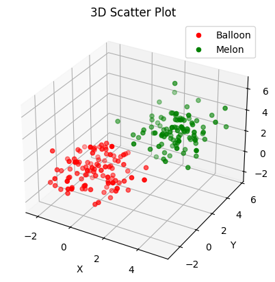
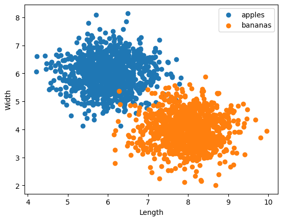
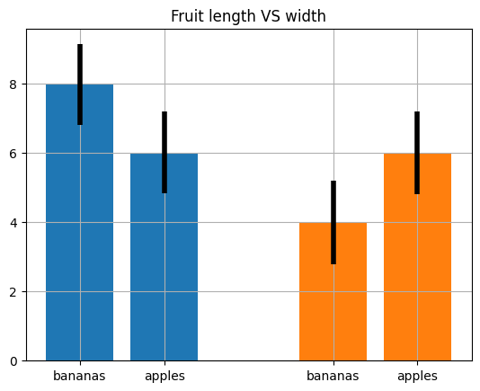
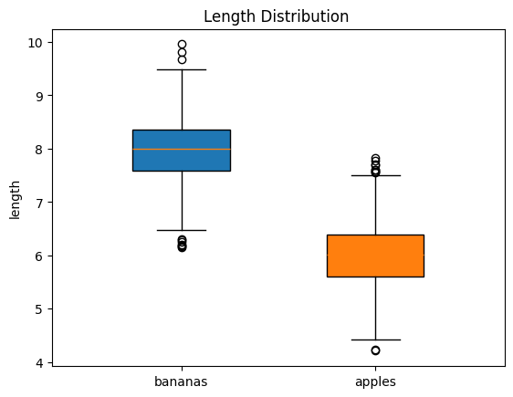
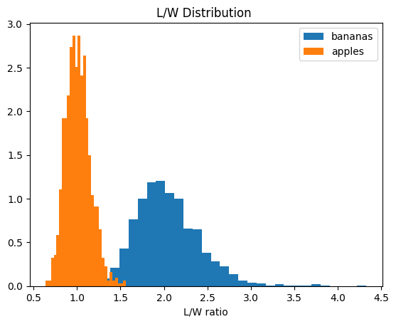
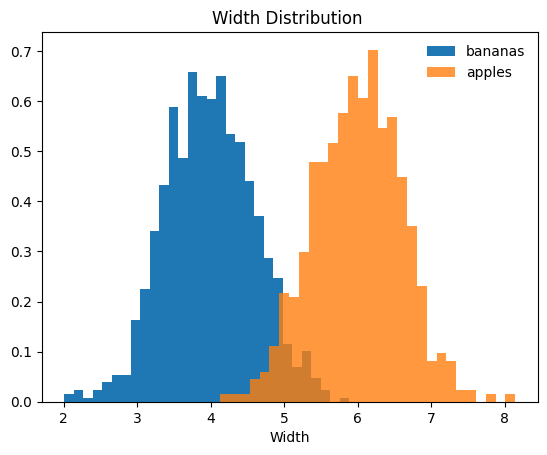
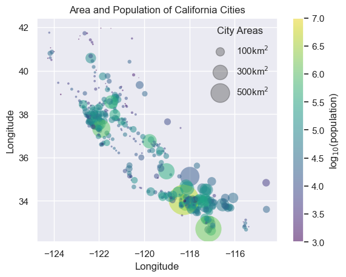

# Plot exercise

## Table of Contents

- [About](#about)
- [Getting Started](#getting_started)
- [Usage](#usage)

## About <a name = "about"></a>

in this part i did some exercise with plot like a 3d plot city population plot and apple banana war plot with scatter plot.

### Output

#### 3d plot



#### apple banana war











#### california cities



## Getting Started <a name = "getting_started"></a>

### Installing

First of all you need install requirements library copy this code and run in terminal.

``` terminal
pip install -r requirements.txt
```

## Usage <a name = "usage"></a>

After you install requirements library you can choice between the projects and run it.

### 3d ploter

``` terminal
jupyter nbconvert --to script 3d_plot.ipynb
```

### apple banana

``` terminal
jupyter nbconvert --to script apple_banana.ipynb
```

### california cities plot

``` terminal
jupyter nbconvert --to script california_cities.ipynb
```
